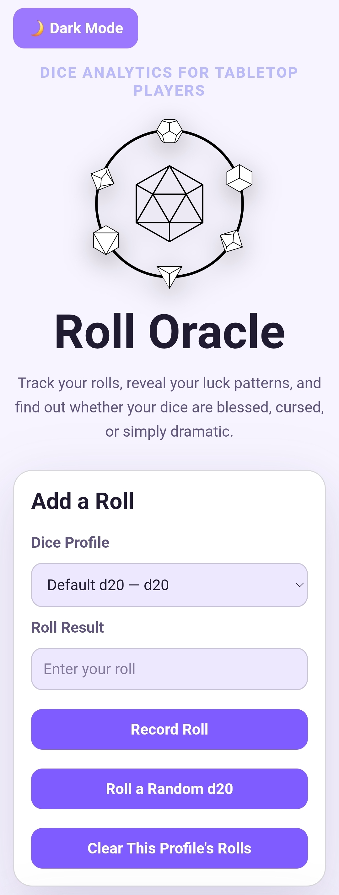

# Roll Oracle

Roll Oracle is a dice analytics web app for tabletop players who want to track roll history, compare dice performance, and find out whether their dice are blessed, cursed, or suspiciously normal.

This project was built as a React/TypeScript capstone project and expanded into a portfolio app focused on state management, user input handling, simple statistics, and responsive UI design.

## Screenshot

<p align="center">
  
</p>

## Live Demo

[View Roll Oracle on GitHub Pages](https://morganneedham.github.io/roll-oracle/)

## Features

- Create separate dice profiles for different dice types
- Record manual roll results
- Generate random dice rolls
- Track recent roll history
- Calculate average roll, highest roll, lowest roll, and most common result
- Display a “Curse Rating” based on roll performance
- Show a visual curse meter
- Toggle between light and dark mode
- Validate roll input based on selected die type

## Tech Stack

- React
- TypeScript
- Vite
- CSS
- GitHub Pages
- GitHub Actions

## AI Usage

I used AI as a learning and development assistant while building Roll Oracle. AI helped me brainstorm project features, understand how to use React state, plan the roll history feature, improve the cursedness rating logic, troubleshoot GitHub Pages deployment, and refine my README/project description.

Examples of AI-assisted ideas or code include:

* Planning how dice profiles could work as tracked items.
* Using React state to store roll history and selected dice profiles.
* Creating validation logic so users cannot enter impossible roll values for a selected die type.
* Designing the cursedness rating concept based on roll averages and roll history.
* Improving the project description and resume-ready bullet points.

## Installation

```bash
git clone https://github.com/MorganNeedham/roll-oracle.git
cd roll-oracle
npm install
npm run dev
